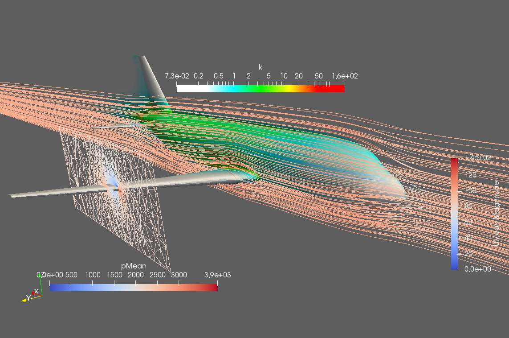

# A simple airflow simulation for the D150 conceptual aircraft using OpenFOAM and Slurm



This is a simple test case to verify a workflow of automatic mesh creation with TiGL. **The simulation parameters have not been chosen for a high level of realism!** So please don't build this aircraft and expect it to fly...

## Usage

 - Login to a compute cluster that uses the [SLURM workload manager](https://slurm.schedmd.com/), e.g. [wr0.wr.inf.h-brs.de](wr0.wr.inf.h-brs.de). 
 - Clone this repository
 
   ```bash
   git clone https://github.com/joergbrech/simpleFoamAirflowD150.git
   ```
   and change the directory

   ```bash
   cd simpleFoamAirflowD150
   ```
- Make sure there exists a module named `openfoam/v1702` that loads the OpenFOAM installation and the necessary MPI software into the environment. If needed, edit the corresponding line in `TiGL_D150_08_16.sh` that loads this module. If you have access to the HBRS cluster and don't know what any of this means, let me know, I can help you set up the module system.
 - Submit the job specified by the script `TiGL_D150_08_16.sh`:
 
   ```bash
   sbatch TiGL_150_08_16.sh
   ```
   On the compute cluster at the H BRS, the calculation takes about four minutes. You can check the status with
 
   ```bash
   squeue -u USERNAME
   ```
   where `USERNAME` is your username.
 
 - The results are stored in `simpleFoam/VTK`. Copy the vtk-files e.g. using [scp](https://www.garron.me/en/articles/scp.html) to your local computer and postprocess them with [Paraview](https://www.paraview.org/). That's all there is to it!
 
## Remarks

 - The script `TiGL_150_08_16.sh` generates the OpenFOAM mesh from a `.msh` file located in the `simpleFOAM` subdirectory. Next, the `boundary` file of the root directory is copied to the OpenFOAM case to replace some boundary conditions, specifically the airplane surface needs to be set to `wall`. The `boundary` file is hardcoded to fit to the `.msh` file, as it includes the submesh names and node and cell numbers. It would not work out of the shell for another mesh.

# Acknowledgements 

Thanks to **[Paul Putin](https://github.com/pputin)** for generating the Mesh from a [CPACS](https://github.com/DLR-SL/CPACS) file created with [TiGL](https://github.com/DLR-SC/tigl) and [Gmsh](https://gitlab.onelab.info/gmsh/gmsh) and for creating the OpenFOAM case!
